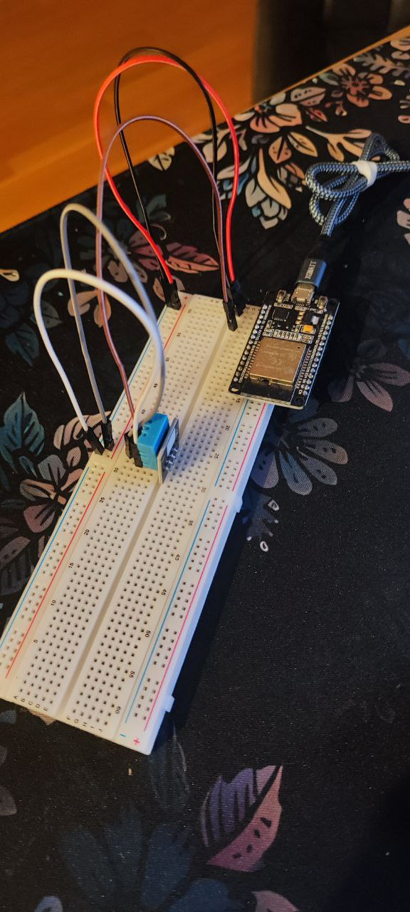

# ESP32

This is a repository with some home projects with
[ESP32 DevKitV1](https://www.circuitstate.com/pinouts/doit-esp32-devkit-v1-wifi-development-board-pinout-diagram-and-reference/)

Main purpose of this repository is to get familiar with embedded development
with rust

## Projects

### temperature

Connects the [DHP11](https://components101.com/sensors/dht11-temperature-sensor)
to the ESP32 board and outputs the current temperature and
humidity to the serial

#### Result temperature

### push-button-led

Utilizes 2 pins (4th as an input and 5th as an output) to read the button state
and if the button is pressed put voltage to the LED

#### Result push-button-led

### potentiometer-led

Uses 10k potentiometer and 1 LED. Reads the value from potentiometer via ADC
on GPIO4 from the potentiometer and produce a PWM signal on GPIO5 that brightens
or dims the LED.

#### Result potentiometer-led

### motion-sensor

Uses [HC-SR501 PIR Sensor](https://lastminuteengineers.com/pir-sensor-arduino-tutorial/),
LED and an active buzzer. Reads the value from the sensor
and if the motion is detected lights up the LED and powers the buzzer

#### Result motion-sensor

